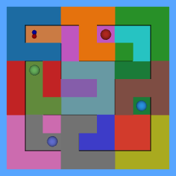
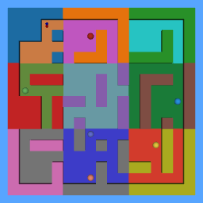

# Memory Maze DrStrategy Environments

Goal-conditioned maze navigation environments adapted from [Memory-Maze](https://github.com/jurgisp/memory-maze) with visual enhancements from [DrStrategy](https://github.com/ahn-ml/drstrategy).

## Environments

| 7×7 Complex Maze | 15×15 Complex Maze |
|---|---|
|  |  |

| Environment ID | Grid | Episode Steps | Description |
|---|---|---|---|
| `MemoryMaze-cmaze-7x7-drstrategy-v0` | 7×7 | 500 | Compact complex maze with colorful textures |
| `MemoryMaze-cmaze-15x15-drstrategy-v0` | 15×15 | 1000 | Large complex maze with colorful textures |

## API

### Observation Space (Dict)

The observation is a `gymnasium.spaces.Dict` with five keys:

| Key | Shape | Dtype | Description |
|---|---|---|---|
| `image` | (64, 64, 3) | uint8 | First-person egocentric camera (HWC) |
| `goal_image` | (64, 64, 3) | uint8 | Pre-rendered image of the current goal location |
| `target_color` | (3,) | float64 | Goal sphere colour, RGB in [0, 1] |
| `position` | (2,) | float64 | Agent position in maze coordinates |
| `direction` | (2,) | float64 | Agent heading unit vector |

### Action Space

Continuous `gymnasium.spaces.Box(shape=(2,))`:

| Index | Meaning |
|---|---|
| `action[0]` | Forward (negative) / Backward (positive) |
| `action[1]` | Turn left (negative) / Turn right (positive) |

### Reward and Info

- **Reward**: 1.0 when the goal is reached, 0.0 otherwise (sparse)
- **`info["success"]`**: `1` on the step the goal is reached, `0` otherwise
- **`info["distance"]`**: L1 distance to the current goal

## Features

- Colorful wall textures using the tab20 colormap, unique per maze section
- Colorful floor textures using block-based tab20 colours
- Goal-conditioned navigation: `goal_image` provides a pre-rendered first-person view from the target location
- 20 distinct target sphere colours
- Physics-based agent (rolling ball with friction)
- Fixed maze layouts for reproducible experiments

## Usage

### Basic Example

```python
import gymnasium as gym
import memory_maze

env = gym.make("MemoryMaze-cmaze-7x7-drstrategy-v0")
obs, info = env.reset()

for _ in range(500):
    action = env.action_space.sample()
    obs, reward, terminated, truncated, info = env.step(action)

    if terminated or truncated:
        obs, info = env.reset()

env.close()
```

### Rendering Backend

Set the `MUJOCO_GL` environment variable before running:

```bash
export MUJOCO_GL=egl     # Hardware-accelerated (recommended)
export MUJOCO_GL=osmesa  # Software rendering for headless servers
```

## Examples

- **`examples/keyboard_control.py`** — Interactive 3-panel matplotlib window (obs / goal_image / top-down view), controlled with WASD keys
- **`examples/save_observations_with_goals.py`** — Saves observations, all pre-rendered goal images, and the top-down view to disk

## Installation

### From Source

```bash
pip install -e .
```

### Rendering Setup

```bash
export MUJOCO_GL=egl     # GPU systems
export MUJOCO_GL=osmesa  # Headless / CPU-only
```

### Verify

```python
import gymnasium as gym
import memory_maze

env = gym.make("MemoryMaze-cmaze-7x7-drstrategy-v0")
obs, info = env.reset()
print(obs["image"].shape)   # (64, 64, 3)
print(env.action_space)     # Box(-inf, inf, (2,), float64)
env.close()
```

## Development

Code formatting uses **black**, **isort**, and **ruff** (configured in `pyproject.toml`). Run tests with **pytest**.
